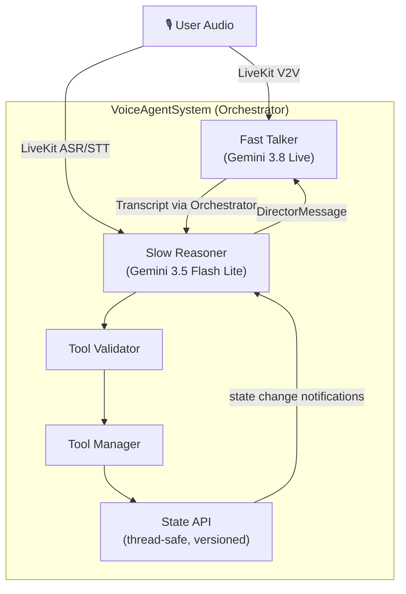

# VoiceAgentV5 — Project Analysis

## What It Is

A **full-duplex, real-time voice agent** built on a **dual-brain architecture** running on [LiveKit](https://livekit.io/). It splits the traditional monolithic LLM agent into two cooperating models:

| Brain | Role | Model | Latency |
|-------|------|-------|---------|
| **Talker** (Fast) | Speaks to the user, keeps conversation fluid | Gemini 3.8 Live (V2V) | Ultra-low |
| **Reasoner** (Slow) | Understands intent, calls tools, directs the Talker | Gemini 3.5 Flash Lite (text) | Higher |

The Talker is intentionally "dumb" — it never calls tools and doesn't know task state. The Reasoner never speaks. They communicate via one-way `DirectorMessage` directives (`SAY`, `NOTE`, `INSTRUCTION`).

---

## Architecture Diagram



---

## File Map

### Core Source ([`src/`](file:///home/arch/Desktop/VoiceAgentV5/src))

| File | Purpose |
|------|---------|
| [`livekit_agent.py`](file:///home/arch/Desktop/VoiceAgentV5/src/livekit_agent.py) | **Entry point.** Connects to LiveKit, wires the Gemini Live V2V model as the Talker, hooks ASR events to feed the Reasoner, and injects Reasoner directives back into the Talker's chat context via `session.generate_reply()`. |
| [`system.py`](file:///home/arch/Desktop/VoiceAgentV5/src/system.py) | **Top-level orchestrator.** Owns every component's lifecycle. Routes Talker transcripts → Reasoner, Reasoner directives → Talker, and user STT → both. |
| [`state.py`](file:///home/arch/Desktop/VoiceAgentV5/src/state.py) | **Centralized state.** Thread-safe (RLock), versioned. Tracks intent, current focus, and all tool calls. Reads return deep copies. Writes notify the Reasoner via callback. |
| [`message_queue.py`](file:///home/arch/Desktop/VoiceAgentV5/src/message_queue.py) | **Exactly-once priority queue.** High-priority messages (tool completions) bypass standard messages. Bounded LRU dedup. Daemon consumer thread. |
| [`tool_manager.py`](file:///home/arch/Desktop/VoiceAgentV5/src/tool_manager.py) | **Tool execution & tracking.** Dispatches tools, tracks in-flight state, handles feedback. Currently uses a **mock 2-second timer** for tool responses. |
| [`validator.py`](file:///home/arch/Desktop/VoiceAgentV5/src/validator.py) | **Tool call validation.** Sits between Reasoner output and Tool Manager. Checks tool name existence; slot/type validation is stubbed. |
| [`manifest_ingestion.py`](file:///home/arch/Desktop/VoiceAgentV5/src/manifest_ingestion.py) | **Startup metaprogramming.** Categorizes tools as read-only vs state-modifying, generates inverse tool schemas. Currently uses a **deterministic simulation** (not the real LLM). |
| [`initializer.py`](file:///home/arch/Desktop/VoiceAgentV5/src/initializer.py) | **Prompt builder.** Templates the Reasoner and Talker instruction files with the tool manifest, state API description, and output format. Uses Gemini to generate a human-friendly tool list for the Talker. |
| [`stt_handler.py`](file:///home/arch/Desktop/VoiceAgentV5/src/stt_handler.py) | **STT stub.** VAD-driven speech-to-text handler (whisper-large-v3-turbo). Currently a skeleton — actual LiveKit V2V handles ASR natively. |

### Agents ([`src/agents/`](file:///home/arch/Desktop/VoiceAgentV5/src/agents))

| File | Purpose |
|------|---------|
| [`reasoner.py`](file:///home/arch/Desktop/VoiceAgentV5/src/agents/reasoner.py) | **The Director.** Maintains full conversation context (last 15 messages). Calls Gemini 3.5 Flash Lite with JSON output mode. Parses `tool_call` and `directive` from the response. Validates tool calls, then dispatches via Tool Manager. Sends directives to the Talker via callback. Also logs internal messages to `localhost:8765` (debug dashboard). |
| [`talker.py`](file:///home/arch/Desktop/VoiceAgentV5/src/agents/talker.py) | **The Chatterbox.** In LiveKit mode, this is largely bypassed — Gemini Live handles V2V natively. The `FastTalker` class exists as a text-mode fallback that generates responses via Gemini 3.5 Flash Lite. |

### Models ([`src/models/`](file:///home/arch/Desktop/VoiceAgentV5/src/models))

| File | Purpose |
|------|---------|
| [`messages.py`](file:///home/arch/Desktop/VoiceAgentV5/src/models/messages.py) | Data classes: `DirectorMessage` (Reasoner→Talker, types: `note`/`say`/`instruction`) and `TalkerTranscript` (what the Talker said, role=`talker`). |

### Config & Instructions

| File | Purpose |
|------|---------|
| [`tool_manifest.json`](file:///home/arch/Desktop/VoiceAgentV5/tool_manifest.json) | 12 tools: flights, booking, identity docs, credit cards, forex, autopay, apartments, commute, search filters, order tracking, product search, cart. Each has `modifies_state` flag. |
| [`reasoner_instructions.md`](file:///home/arch/Desktop/VoiceAgentV5/reasoner_instructions.md) | Detailed system prompt for the Reasoner — state discipline, tool call rules, message types, handling corrections/cancellations, image support. |
| [`talker_instructions.md`](file:///home/arch/Desktop/VoiceAgentV5/talker_instructions.md) | System prompt for the Talker — core honesty rules, turn-taking, status tool usage, how to handle system messages. |
| [`start_livekit.sh`](file:///home/arch/Desktop/VoiceAgentV5/start_livekit.sh) | Bootstraps venv, installs deps, runs `python -m src.livekit_agent dev`. |
| [`.env`](file:///home/arch/Desktop/VoiceAgentV5/.env) | Google API key, LiveKit cloud credentials (URL, API key, secret). |

### Other

| Path | Purpose |
|------|---------|
| [`Full-Duplex-Bench/`](file:///home/arch/Desktop/VoiceAgentV5/Full-Duplex-Bench) | Separate benchmark repo (v1, v1.5, v2, v3) for evaluating full-duplex voice agents. |
| [`User_testing/`](file:///home/arch/Desktop/VoiceAgentV5/User_testing) | User testing materials. |
| [`tests/test_system.py`](file:///home/arch/Desktop/VoiceAgentV5/tests/test_system.py) | Unit tests for the orchestrator system. |
| `whisper-large-v3-turbo/` | Local Whisper model weights (not actively used — LiveKit V2V handles ASR). |

---

## Data Flow (Runtime)

```
1. User speaks → LiveKit room
2. Gemini 3.8 Live (V2V) responds instantly (the Talker)
3. LiveKit ASR transcribes user speech → `on_conversation_item_added`
4. User transcript → `system.reasoner.ingest_user_stt(text)`
5. Reasoner's message queue → `_analyze_and_direct()`
6. Gemini 3.5 Flash Lite returns JSON: {tool_call?, directive?}
7a. tool_call → Validator → Tool Manager → State API → mock result (2s)
7b. directive → `on_direct_callback` → `session.generate_reply(user_input="[SYSTEM:SAY] ...")`
8. Talker transcript → `system.feed_talker_transcript(text)` → Reasoner context
```

---

## Key Design Decisions

- **Separation of concerns**: The Talker is fast but ignorant; the Reasoner is complete but slow. Neither crosses into the other's domain.
- **State as single source of truth**: Versioned, thread-safe, deep-copy reads. Non-Reasoner mutations auto-notify the Reasoner via callback.
- **Exactly-once message delivery**: Priority queue with LRU dedup prevents duplicate processing and ensures tool completions are handled before new user input.
- **Mock tool execution**: All tools currently return `{"mock": "result"}` after 2 seconds. Real API integration is a TODO.
- **Debug dashboard**: Internal messages are pushed to `localhost:8765` for a live debug UI.

## Notable TODOs / Stubs

1. **Tool Manager** — mock API only; no real external tool integration
2. **Manifest Ingestion** — `_simulate_llm_response()` used instead of real LLM categorization
3. **Tool Validator** — only checks tool name existence; no slot/type validation
4. **STT Handler** — skeleton; LiveKit's native V2V ASR is used instead
5. **Reflex Engine** — mentioned in docs/instructions but not yet implemented in code
6. **`asyncio.run()` in threads** — [reasoner.py:147](file:///home/arch/Desktop/VoiceAgentV5/src/agents/reasoner.py#L147) creates a new event loop per call, which is fragile
